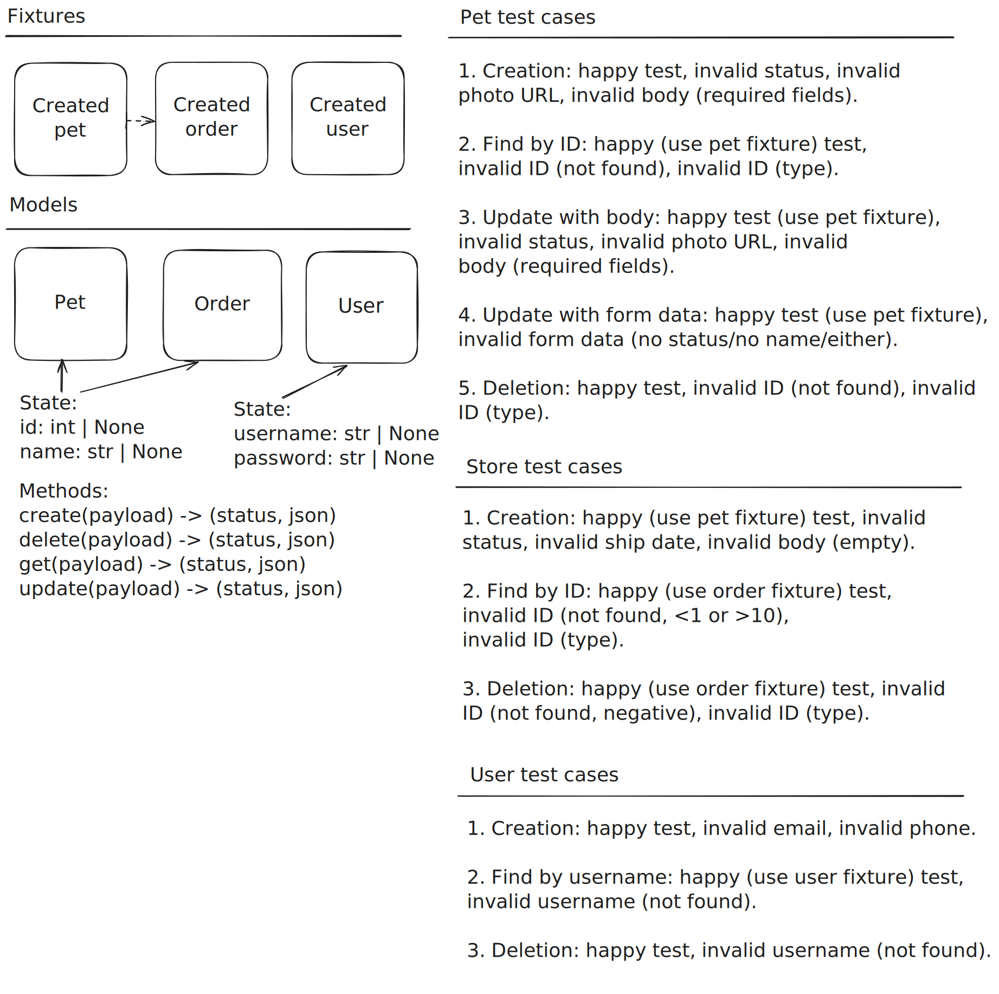

# Тестовое задание

## Установка зависимостей

1. Убедитесь, что у вас установлен Python3.

2. Откройте виртуальное окружение:

```bash
python -m venv .venv
```

3. Установите pytest и requests:

```bash
pip3 install pytest requests
```

## Запуск тестов

```bash
python3 -m pytest tests
```

## Схема

